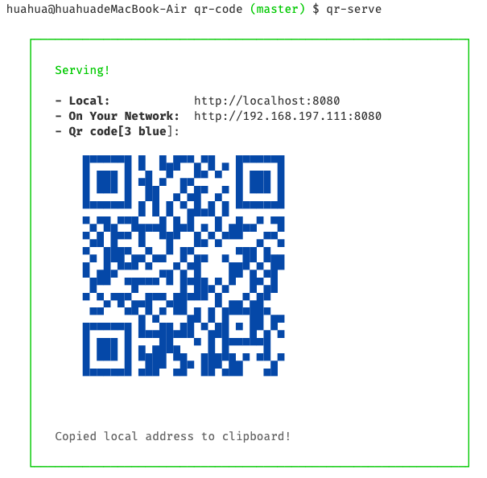
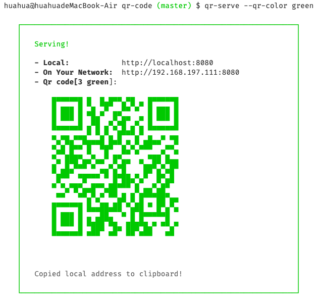

- [中文](/docs/readme-chinese.md)
- [English](readme.md)

感谢[serve-7](https://zeit.co/blog/serve-7)的启发。如果你想要寻找一种轻量级的工具，用于托管一个静态网站，单页面应用等，并适用于手机端调试，支持自动获取本机 IP 并以二维码呈现，这个工具将会是你最好的选择。

## 特性

- 轻量级 CLI 工具
- 托管静态 SPA app
- 支持动态解析本地 IP
- 支持自定义二维码的尺寸与颜色
- 支持生成访问链接二维码，用手机扫描访问（创新点）

## 安装

在工程目录下局部安装，并通过`npx qr-serve`调用

```
npm install qr-serve --save
npx qr-serve
```

全局安装，适用于电脑所有工程

```
npm install qr-serve -g
```

一旦完成安装，在你的工程根目录下运行如下命令

```
qr-serve
```

...或者指定托管目录的路径:

```
qr-serve folder_name
```

## 用法

### 示例

你可以用命令 `qr-serve` 托管静态网站.

```
qr-serve
```



### 自定义 颜色

用法: `qr-serve --qr-color [options]`
Colors 选项:

- black
- red
- green
- yellow
- blue
- magenta
- cyan
- white

**示例**

```
qr-serve --qr-color green
```



### 自定义 尺寸

用法: `qr-serve --qr-size [options]`
尺寸 选项:
支持 [2-40]范围的数字

**示例**


## 开源协议

[MIT](license)
