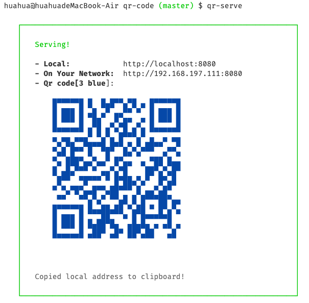
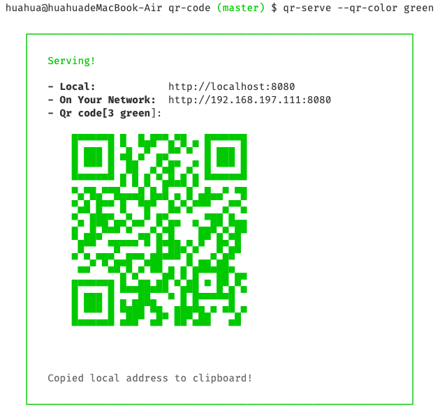
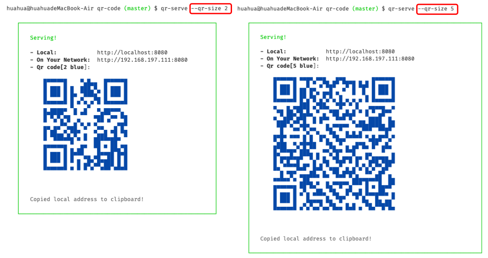

- [中文](/docs/readme-chinese.md)
- [English](readme.md)

Inspired by [serve-7](https://zeit.co/blog/serve-7). Assuming you would like to serve a static site, single page application or just a static file (no matter if on your device or on the local network), this package is just the right choice for you.

## Highlights

- Light-weight CLI utility
- Ability to serve SPA app
- Ability to query LAN IP
- Ability to transform IP into QR Codes and display on terminal
- Support for changing QR Code size and color

## Install

Install inside your project's directory and just run `npx qr-serve`.

```
npm install qr-serve --save
npx qr-serve
```

Install the package globally.

```
npm install qr-serve -g
```

Once that's done, you can run this command inside your project's directory...

```
qr-serve
```

...or specify which folder you want to serve:

```
qr-serve folder_name
```

## Usage

### Example

You can use `qr-serve` to serve static site.

```
qr-serve
```



### Custom colors

Usage: `qr-serve --qr-color [options]`
Colors Options:

- black
- red
- green
- yellow
- blue
- magenta
- cyan
- white

**Example**

```
qr-serve --qr-color green
```



### Custom size

Usage: `qr-serve --qr-size [options]`
Size Options:
it should be number, in [2-40]

**example**


## License

[MIT](license)
